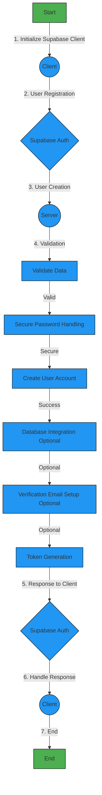
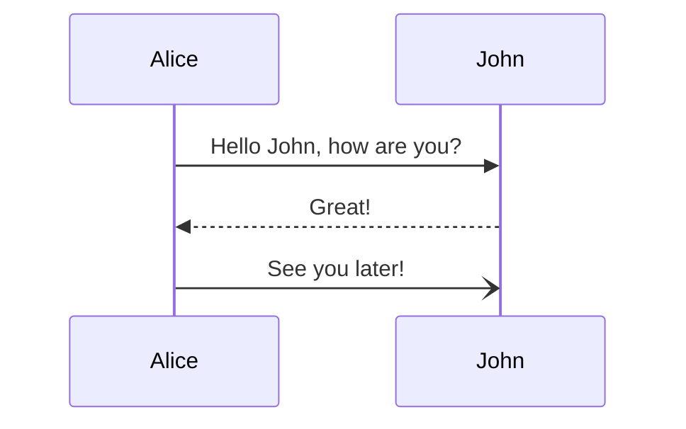
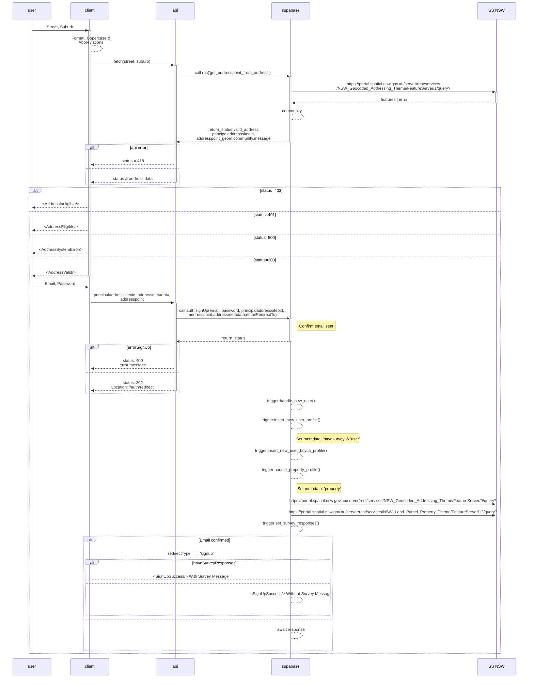

## Process Overview

```mermaid
%%{init: {"flowchart": {"defaultRenderer": "elk"}} }%%
flowchart TD;
  A[Start] -->|1. Initialize Supabase Client| B((Client));
  B -->|2. User Registration| C{Supabase Auth};
  C -->|3. User Creation| D((Server));
  D -->|4. Validation| D1[Validate Data];
  D1 -->|Valid| D2[Secure Password Handling];
  D2 -->|Secure| D3[Create User Account];
  D3 -->|Success| D4[Database Integration Optional];
  D4 -->|Optional| D5[Verification Email Setup Optional];
  D5 -->|Optional| D6[Token Generation];
  D6 -->|5. Response to Client| E{Supabase Auth};
  E -->|6. Handle Response| F((Client));
  F -->|7. End| G[End];

  style A fill:#4CAF50,stroke:#000
  style B fill:#2196F3,stroke:#000
  style C fill:#2196F3,stroke:#000
  style D fill:#2196F3,stroke:#000
  style D1 fill:#2196F3,stroke:#000
  style D2 fill:#2196F3,stroke:#000
  style D3 fill:#2196F3,stroke:#000
  style D4 fill:#2196F3,stroke:#000
  style D5 fill:#2196F3,stroke:#000
  style D6 fill:#2196F3,stroke:#000
  style E fill:#2196F3,stroke:#000
  style F fill:#2196F3,stroke:#000
  style G fill:#4CAF50,stroke:#000
```

```mermaid
sequenceDiagram
    participant Alice
    participant John
    links Alice: {"Dashboard": "https://dashboard.contoso.com/alice", "Wiki": "https://wiki.contoso.com/alice"}
    links John: {"Dashboard": "https://dashboard.contoso.com/john", "Wiki": "https://wiki.contoso.com/john"}
    Alice->>John: Hello John, how are you?
    John-->>Alice: Great!
    Alice-)John: See you later!
```

```mermaid
sequenceDiagram
    participant u as user
    participant c as client
    participant a as api
    participant sb as supabase
    participant ss as SS NSW
    u->>+c: Street, Suburb
    c-->c: Format: Uppercase & <br>Abbreviations
    c->>+a: fetch(street, suburb)
    a->>+sb: call rpc('get_addresspoint_from_address')
    sb->>+ss: https://portal.spatial.nsw.gov.au/server/rest/services<br>/NSW_Geocoded_Addressing_Theme/FeatureServer/1/query?
    ss-->>-sb: features | error
    sb-->sb: community
    sb-->>-a: return_status,valid_address<br>principaladdresssiteoid,<br>addresspoint_geom,community,message
    alt api error
        a-->>c: status = 418
    else
        a-->>-c: status & address data
    end
    alt status=403
        c-->>u: <AddressIneligible/>
    else  status=401
        c-->>u: <AddressEligible/>
    else  status=500
        c-->>u: <AddressSystemError/>
    else  status=200
        c-->>-u: <AddressValid/>
        u->>+c: Email, Password
        c->>+a: principaladdresssiteoid, addressmetadata, <br/>addresspoint
        a->>+sb: call auth.signUp(email, password, principaladdresssiteoid, , <br/>addresspoint,addressmetadata,emailRedirectTo)
        Note right of sb: Confirm email sent
        sb-->>-a: return_status
        alt errorSignUp
            a-->>c: status: 400<br/>error message
        else
            a-->>-c: status: 302<br/>Location: '/auth/redirect'
        end
        sb-->sb: trigger:handle_new_user()
        sb-->sb: trigger:insert_new_user_profile()
        Note right of sb: Set metadata: 'havesurvey' & 'user'
        sb-->sb: trigger:insert_new_user_bcyca_profile()
        sb-->sb: trigger:handle_property_profile()
        Note right of sb: Set metadata: 'property'
        sb->>+ss: https://portal.spatial.nsw.gov.au/server/rest/services/NSW_Geocoded_Addressing_Theme/FeatureServer/0/query?
        sb->>+ss: https://portal.spatial.nsw.gov.au/server/rest/services/NSW_Land_Parcel_Property_Theme/FeatureServer/12/query?
        sb-->sb: trigger:set_survey_responses()
        alt Email confirmed
             sb-->c: redirectType === 'signup'
             alt haveSurveyResponses
                 sb-->c: <SignUpSuccess/> With Survey Message
            else
                 sb-->sb: <SignUpSuccess/> Without Survey Message
            end
        else
             sb-->sb: await response
        end
    end
```
