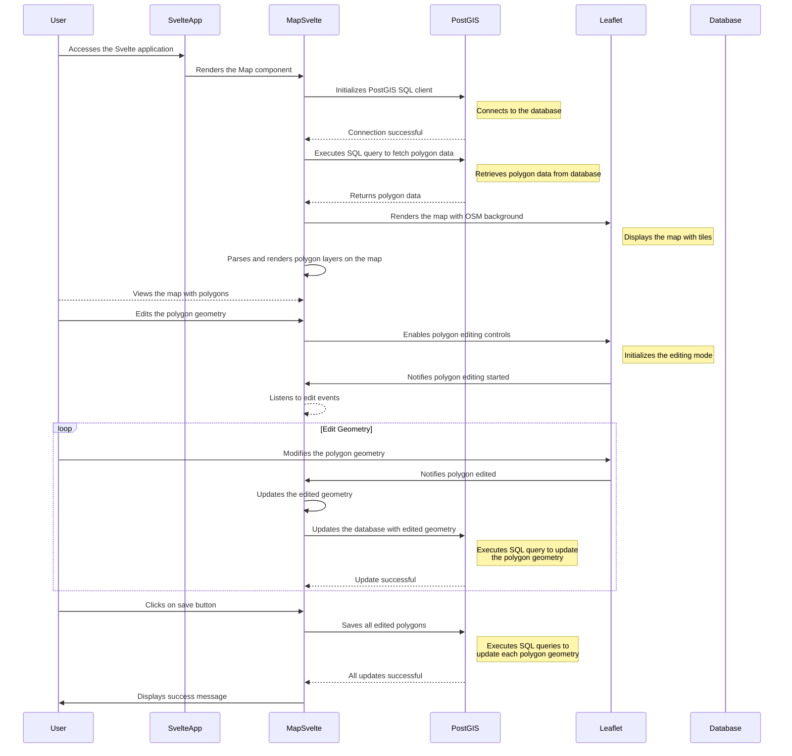

## Map Editor

```mermaid
sequenceDiagram
participant User
participant SvelteApp
participant MapSvelte
participant PostGIS
participant Leaflet
participant Database

    User->>SvelteApp: Accesses the Svelte application
    SvelteApp->>MapSvelte: Renders the Map component
    MapSvelte->>PostGIS: Initializes PostGIS SQL client
    Note right of PostGIS: Connects to the database
    PostGIS-->>MapSvelte: Connection successful
    MapSvelte->>PostGIS: Executes SQL query to fetch polygon data
    Note right of PostGIS: Retrieves polygon data from database
    PostGIS-->>MapSvelte: Returns polygon data
    MapSvelte->>Leaflet: Renders the map with OSM background
    Note right of Leaflet: Displays the map with tiles
    MapSvelte->>MapSvelte: Parses and renders polygon layers on the map
    User-->>MapSvelte: Views the map with polygons

    User->>MapSvelte: Edits the polygon geometry
    MapSvelte->>Leaflet: Enables polygon editing controls
    Note right of Leaflet: Initializes the editing mode
    Leaflet->>MapSvelte: Notifies polygon editing started
    MapSvelte-->>MapSvelte: Listens to edit events

    loop Edit Geometry
        User->>Leaflet: Modifies the polygon geometry
        Leaflet->>MapSvelte: Notifies polygon edited
        MapSvelte->>MapSvelte: Updates the edited geometry

        MapSvelte->>PostGIS: Updates the database with edited geometry
        Note right of PostGIS: Executes SQL query to update<br>the polygon geometry
        PostGIS-->>MapSvelte: Update successful
    end

    User->>MapSvelte: Clicks on save button
    MapSvelte->>PostGIS: Saves all edited polygons
    Note right of PostGIS: Executes SQL queries to<br>update each polygon geometry
    PostGIS-->>MapSvelte: All updates successful
    MapSvelte->>User: Displays success message
```
